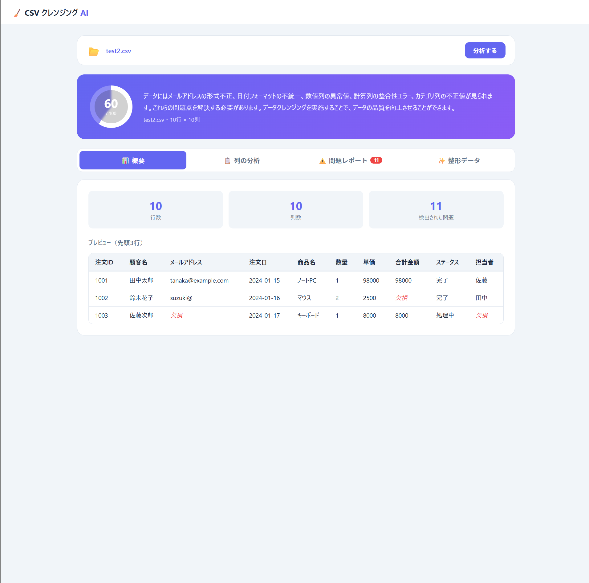
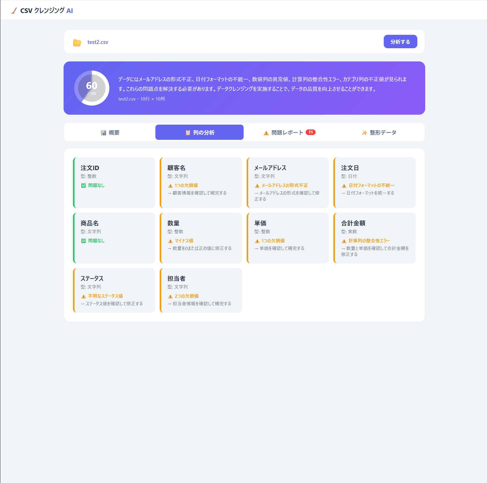
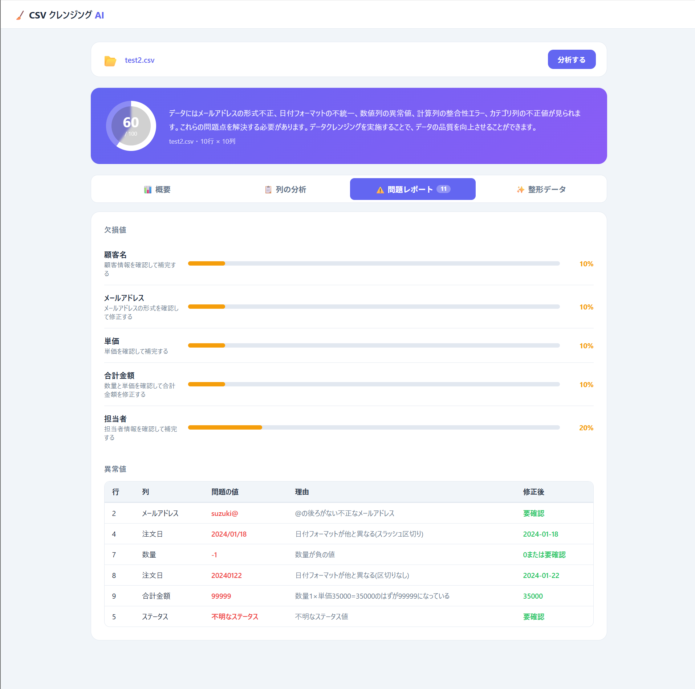
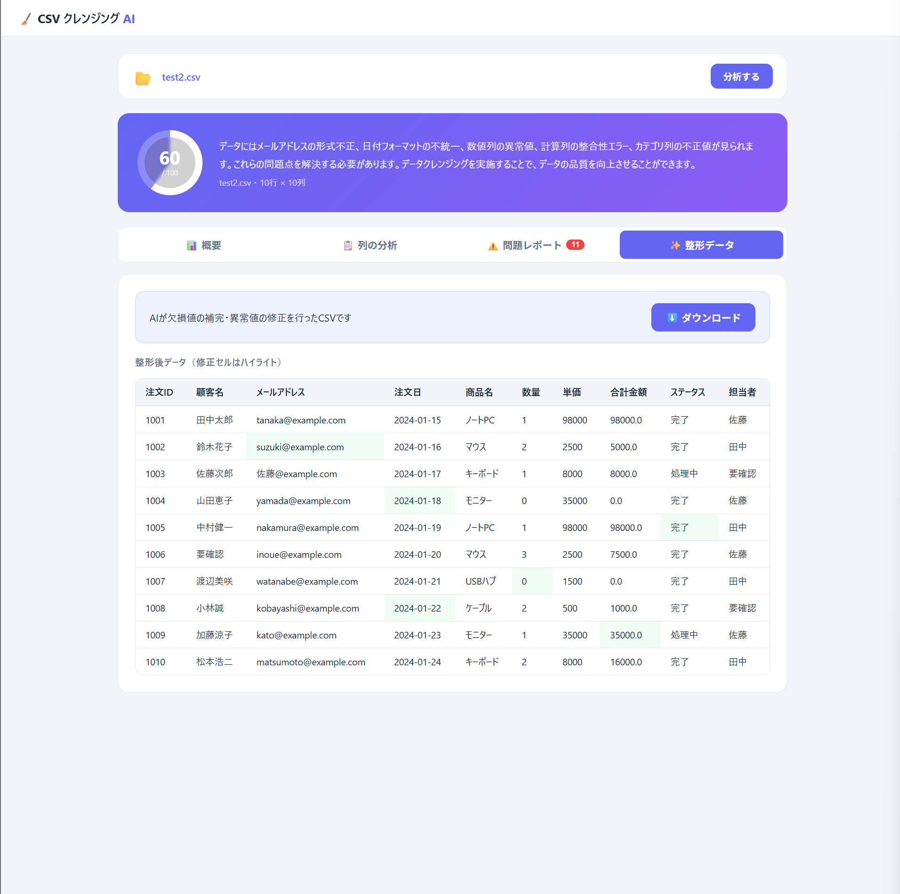

# 🧹 CSV クレンジング AI

CSVファイルをアップロードするだけで、AIがデータ品質を自動分析・整形するWebアプリです。


## 機能

- 📊 **データ品質スコア** — 0〜100点でCSVの品質を採点
- 📋 **列ごとの分析** — データ型・問題点・対処法を自動検出
- ⚠️ **問題レポート** — 欠損値・異常値を一覧表示
- ✨ **整形データ** — AI が補完・修正したCSVをダウンロード

## 技術スタック

| レイヤー | 技術 |
|---|---|
| バックエンド | Python / FastAPI |
| AI | Groq API（LLaMA 3.3 70B） |
| データ処理 | pandas |
| インフラ | Docker / docker-compose |
| フロントエンド | HTML / CSS / JavaScript |

## 起動方法

### 1. リポジトリをクローン

```bash
git clone https://github.com/your-username/csv-cleaner.git
cd csv-cleaner
```

### 2. APIキーを設定

```bash
cp .env.example .env
# .env を編集して AI_API_KEY を設定
```

### 3. 起動

```bash
docker compose up --build
```

### 4. ブラウザでアクセス
http://localhost:8000

## 環境変数

| 変数名 | 説明 | 取得先 |
|---|---|---|
| `AI_API_KEY` | API キー | Groq: https://console.groq.com / OpenAI: https://platform.openai.com  |

## ディレクトリ構成
csv-cleaner/

├── app/

│   ├── main.py          # FastAPI エンドポイント

│   ├── ai.py            # AI分析ロジック（Groq API）

│   └── requirements.txt # 依存ライブラリ

├── static/

│   └── index.html       # フロントエンド

├── Dockerfile

├── docker-compose.yml

├── .env.example

└── README.md

## スクリーンショット

### 概要 — データ品質スコアとプレビュー


### 列の分析 — データ型・問題点を自動検出


### 問題レポート — 欠損値・異常値を一覧表示


### 整形データ — 修正セルをハイライト表示


## ライセンス

MIT